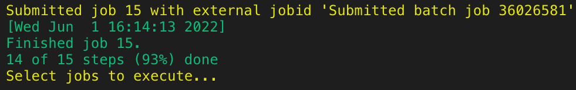

# `sm-SNIPER`


<p align="center">
  
</p>


A Snakemake workflow for **Highly accurate Single Nucleotide polymorphisms calling and Implication of haplotypes in Probe-capture based long-Read Nanopore sequencing** from raw FastQ to phased VCF

Table of contents
----------------
  * [Authors](#authors)
  * [Software](#software)
  * [Methods](#dependencies)
  * [Features](#features)
  * [Usage](#usage)
  * [Installation](#installation)
  * [Configuration](#resultsration)
  * [Execution](#execution)
  * [Examples Dataset](#examples-dataset)
  * [Result](#result)
  * [Benchmarking](#benchmarking)
  * [Haplotype phasing](#Haplotype-phasing)
  * [Tips & FAQs](#tips)
  * [Reporting Issue](#reporting-issue)
  * [Link](#link)


## Authors
- [Myo T. Naung](https://github.com/myonaung)
- [Andrew Guy](https://github.com/andrewguy)
- [Swapnil Tichkule](https://github.com/Swap90)
- [Somesh Mehra](https://github.com/smehra34)

## Software
This project is written based on the following software

| Software       | Reference (DOI)                                   |
| :------------: | :-----------------------------------------------: |
| BCFtools       | https://doi.org/10.1093/gigascience/giab008       |
| bedtools       | https://doi.org/10.1093/bioinformatics/btq033     |
| GATK-4         | https://doi.org/10.1038/ng.806                    |
| longshot       | https://doi.org/10.1038/s41467-019-12493-y        |
| minimap2       | https://doi:10.1093/bioinformatics/btab705        |
| NanoSim        | https://doi.org/10.1093/gigascience/gix010        |
| PEPPER         | https://doi.org/10.5281/zenodo.5275510            |
| R-tidyverse    | https://doi.org/10.21105/joss.01686               |
| samtools       | https://doi.org/10.1093/bioinformatics/btp352     |
| Snakemake      | https://doi.org/10.12688/f1000research.29032.2    |
| VCFtools       | https://doi.org/10.1093/bioinformatics/btr330     |
| WhatsHap       | https://doi.org/10.1186/s13059-020-02158-1        |


## Dependencies 
The following software are required to install prior to running sm-SNIPER
* [Conda](https://docs.conda.io/en/latest/) >= 4.12.0
* [Singularity](https://github.com/apptainer/singularity) >= 3.8.5 
* [graphviz](https://graphviz.org/) (optional)

## Features
- Mapping to the reference genome
- Quality control: Read-depth and coverage calculation
- Variant calling with [longshot](https://github.com/pjedge/longshot)
- Variant calling with [PEPPER](https://github.com/kishwarshafin/pepper) which is run on singularity container
- Merging SVNs supported by both callers
- Classification of variants (SVNs) by Support Vector Machine based on in-house reference database (it is genereated by sequencing of reference strains using [STAR-seq protocol](https://www.protocols.io/private/ACE2C16BC17D11EC94CE0A58A9FEAC02))
- Final variant call
- Generation of only primary alignment BAM files

<p align="center">
  
</p>

<h4 align="center">Figure 1: Framework for variation discovery with sm-SNIPER.</h4>


## Usage

The usage of this workflow is described in the [Snakemake Workflow Catalog](https://snakemake.github.io/snakemake-workflow-catalog/?usage=<owner>%2F<repo>).

## Installation
1. Install snakemake, which requires conda & mamba, according to the [documentation](https://snakemake.readthedocs.io/en/stable/getting_started/installation.html)
2. Clone/download this repository (e.g. `git clone https://github.com/myonaung/sm-SNIPER.git`)
## Configuration
### Sample annotation specifications
* `Input (FastQ)` files must be annotated with sample name, and thus `(sample_name).fastq`.
* Based on the analyses, the following parameters in the `workflow/config/config.yaml` file and resource files in `workflow/resources/` are to be adjusted 

- `reference` - name of the target reference genome along with index .fai file from workflow/resources/ folder (e.g. resources/2. PlasmoDB-46_Pfalciparum3D7_Genome.fasta)
- `bed` - bed coordinate files for region of interest
- `data` - file path to folder that contains fastq files (e.g. desktop/fastq)
- `ont_chemistry` - the chemistry of flowcell used for sequencing (default is R9 flowcell that is `ont_r9_guppy5_sup`, other options include `ont_r10_q20` for R10 chemistry or `hifi` (for Hifi). 
- `min_coverage`: minimum coverage used for variant calling
- `max_coverage`: maximum coverage used for variant calling
- `min_alt_frac`: specification of a potential SNV (or minor clones in the case of malaria multiclonal infection) to have at least this fraction of alternate allele observations
* Based on nature of data to be analysed, it is recommended to change `svm_training_longshot.txt` and `svm_training_pepper.txt` from `workflow/resources/` folder. However, in the absence of reference dataset, the `training dataset` from  `workflow/resources/` should suffice.
* Failed log from downstream `PEPPER` variant calling steps are to be ignored at the moment since they are not relying for the pipeline.


### Execution

#### 1. Install and activate conda environment
It is recommended to execute always from within top level of the pipeline directory (i.e `sm-SNIPER/`). Firstly, conda environment that includes all the core software has to be installed upon the first run of the workflow. It might take several minutes.

```
###envname can be replaced by any name

git clone https://github.com/myonaung/sm-SNIPER.git

conda env create --name envname --file=workflow/envs/default.yml
conda activate envname
```
#### 2. Download singularity image
Singularity image for PEPPER variant calling step has to be downloaded, and placed it under `workflow/envs` folder.

```
cd sm-SNIPER
singularity pull docker://kishwars/pepper_deepvariant:r0.7
mv pepper_deepvariant_r0.7.sif workflow/envs
```
#### 2. Build folder structure (will be replaced with a different feature soon)
Relevent folders to run sm-SNIPER is created using `init.sh`. The path to data (i.e. fastq files) has to be added to the `init.sh` file.

```
sh init.sh
```

#### 4. Execute a dry-run
Checking the pipeline with dry-run options. It is to print print a summary of the DAG of jobs
```
cd workflow
snakemake -p -n
```
#### 5. Execute workflow local
Command for execution with two cores
```
cd workflow
snakemake -p -c2 -k
```

#### 6. Execute workflow on a cluster
#### 6a. Slurm system
```
snakemake --profile slurm/
```
<p align="center">
  
</p>


## Examples Dataset
To ensure reproducibility of results and to make the pipeline easy-to-replicate, we provide all required reference data for the analysis on Zendodo: 
- [nanopore amplicon-seq FastQ file from clinical samples](https://zenodo.org/deposit/6571220)
- [nanopore simulated FastQ](https://zenodo.org/deposit/6571220)

## Result

The output can be found in the `sm-SNIPER/workflow/results`.

| #CHROM    | POS     |REF   | ALT   |FILTER|INFO             | Genotype (GT)  |
| :-------: | :-----: | :--: | :---: |:---: |:--------------: | :---: |
Pf3D7_11_v3 | 1294380 | T    | A     |PASS  | DP=111; AC=38,60|  1\|0|
Pf3D7_11_v3 | 1294446 | A    | T     |PASS  | DP=120; AC=37,65|  1\|0|
Pf3D7_11_v3 | 1294995 | T    | A     |PASS  | DP=151; AC=46,82|  1\|0|
Pf3D7_11_v3 | 1295430 | A    | T     |PASS  | DP=90; AC=30,54 |  1\|0|

## Benchmarking

## Haplotype phasing  

Haplotype phasing method used in `sm-SNIPER` was based on `longshot` and [WhatsHap](https://github.com/whatshap/whatshap), and thus haplotype switch error may still present in the cases where there are more than 2 infected strains in a single sample. Therefore, for the best results in haplotype phasing, we recommend to use [SHAPEIT4](https://odelaneau.github.io/shapeit4/#documentation) which uses phase information (*value of phase tag (PS) block*) from WhatsHap to extract phase information from our filtered bam file.

To reconstruct the fasta files from a phased VCF, the `bcftools consensus` command can be used. 

```
bgzip phased.vcf
tabix phased.vcf.gz
bcftools consensus -H 1 -f reference.fasta phased.vcf.gz > haplotype1.fasta
bcftools consensus -H 2 -f reference.fasta phased.vcf.gz > haplotype2.fasta
```
## Tips
Here are some tips for troubleshooting & FAQs:
- always first perform a dry-run with option `-n`
- always run the pipeline with `-k` options to complete independent steps if an upstream step fails
- in case the pipeline crashes, manually cancel the pipeline as follow
```
snakemake --unlock 
snakemake -k -c8 --rerun-incomplete
```
- command for generating the directed acyclic graph (DAG) of all jobs with current resultsration (installation of [graphviz](https://graphviz.org/) will be required)
```
snakemake --dag --forceall | dot -Tsvg > workflow/dags/all_DAG.svg
```

## Reporting Issue
Please create issue [here](https://github.com/myonaung/sm-SNIPER/issues/new) for any problem developed from using `sm-SNIPER` or to request a new features.

## Link
[Github page](https://myonaung.github.io/sm-SNIPER/)


